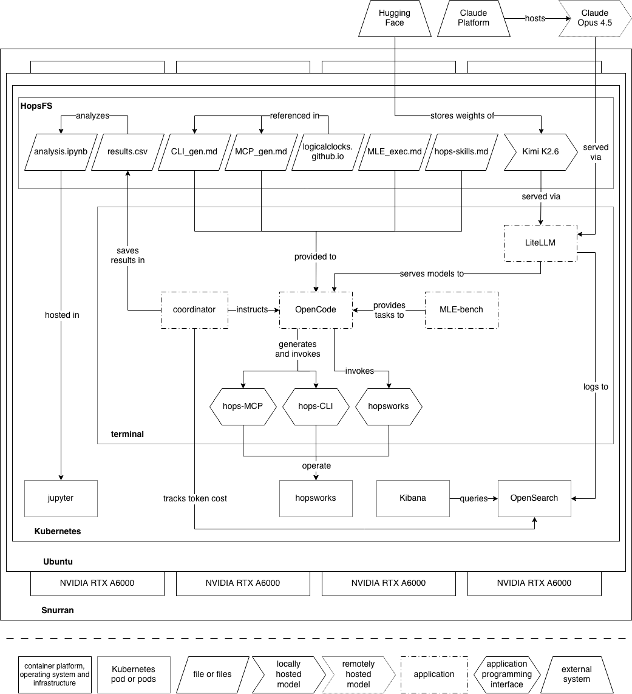

# banter

> Evaluation framework for optimizing the cost, latency and quality of AI agents invoking MLOps platform interfaces (CLI, MCP, Python SDK).

A Kaggle-competition agent runs end-to-end through Claude Code, with every model call routed through a LiteLLM proxy via `ANTHROPIC_BASE_URL`. The coordinator records cost, latency, and the official MLE-bench grade per (task × interface) combination so you can compare interface designs head-to-head.

This repo has two top-level directories:

- [`testbed/`](testbed/) — the runnable evaluation framework (everything in this README).
- [`thesis/`](thesis/) — LaTeX source for the accompanying thesis.

All `make` commands below run from inside `testbed/`.

## Architecture



## Vocabulary

- **cell** — one combination of `(model, interface, task, skill)`. The unique key in `results/results.csv`.
- **task** — one execution of one Kaggle competition by the agent. Each invocation runs one task and writes one row.
- **interface** — `local` (no platform), `cli`, `sdk`, or `mcp`. The independent variable.
- **skill** — optional project-specific markdown injected as a Claude Code slash command. Identity is `<file_id>@<short_hash>` (e.g. `hops/v1@a1b2c3d4`), so a silent edit to a skill file produces a new identity rather than overwriting prior measurements.
- **rep** — slot 0..REPS-1 within a cell, auto-assigned by the coordinator to the lowest free slot. If all slots are already filled the run is skipped, so re-running `make task*` is idempotent: only missing cells are measured. Drop rows from `results.csv` (or `make clean`) to re-measure.
- **task feedback** — separate Claude Code session that reads a finished task's workspace and writes `feedback.md` back into it. Skipped when `INTERFACE=local`. Side-effect only: not counted in `results.csv`.
- **workspace** — `results/runs/<n>/`, where `<n>` is a sequential id assigned per invocation. Old workspaces accumulate on disk for traceability; `task_path` in the CSV always points at the workspace for the current row.

## Quick start

```bash
cd testbed

make install                             # tmux, make, uv, node, claude, python deps
                                         # also prompts for kaggle.json placement

# .env          — ANTHROPIC_API_KEY=...
# .agent.env    — credentials/config exposed to the agent (e.g. HOPSWORKS_API_KEY)
# .kaggle/kaggle.json — legacy {"username":"...","key":"..."}, chmod 600
# accept rules at https://www.kaggle.com/c/<competition>/rules

make prepare-task TASK=aerial-cactus-identification
make start                               # tmux: LiteLLM (top) + shell (bottom)
make task-test                           # smoke run on cactus
```

## Make targets

| Target | What it does |
| --- | --- |
| `install` | Install tmux, make, uv, node, claude code; `uv sync`; install base agent packages from `requirements-base.txt`; copy `.env`; prompt for `kaggle.json`. |
| `prepare-task TASK=<slug>` | `mlebench prepare` for one Kaggle competition. Pre-flight checks ToS acceptance. Idempotent. |
| `start` / `stop` | tmux session: LiteLLM + shell. |
| `task TASK=<slug>` | One competition. Defaults to aerial-cactus. |
| `task-test` | Smoke task on aerial-cactus. |
| `task-xs` | The 8 thesis competitions. |
| `task-s` | MLE-bench's 22-competition Lite split. |
| `interface-build TYPE=<cli\|mcp> NAME=<n> DOCS=<url\|path>` | Generate an interface from docs (clones GitHub repos to `.local/docs/`). |
| `interface-install TYPE=<…> NAME=<n> [SOURCE=<path\|git+url\|pypi-name>] [BIN=<bin>]` | Install + register + agent reachability probe. Propagates `agent.env.example` keys into `.agent.env`. |
| `interface-uninstall TYPE=<…> NAME=<n>` | Reverse install (uses install manifest). |
| `interface-test [TYPE=<…>] [NAME=<n>]` | Static readiness check across built interfaces. |
| `clean` | Wipe per-cell workspaces under `results/`, events log, MLE-bench `cache/`. Keeps `results.csv`, `.venv`, dataset, `.kaggle`. |
| `reset` | `clean` + remove `results.csv`. |
| `reset-all` | `reset` + remove `.venv`, `.local/` (MLE-bench datasets, doc clones). |

Run-target overrides:

```bash
make task TASK=titanic                   # any Kaggle competition slug
make task INTERFACE=local,cli,mcp        # comma-separated subset
make task INTERFACE=all                  # = local sdk cli mcp
make task SKILLS=hops                    # latest prompts/skills/hops/v*.md
make task SKILLS=hops/v2                 # explicit version
make task REPS=3                         # repeat each (interface × task) 3 times
make task PROJECT=hops                   # classify CLI/SDK/MCP calls of `hops` separately
make task MODEL=claude-opus              # override the default sonnet
```

## Layout

```
.
├── README.md                           # this file
├── thesis/                             # LaTeX thesis source
└── testbed/
    ├── Makefile                        # entry points
    ├── pyproject.toml                  # banter package + deps
    ├── requirements-base.txt           # ML packages pre-installed into shared venv (torch, sklearn, …)
    ├── .claude/settings.json           # Claude Code config (model + MCP registrations)
    ├── .env / .env.example             # ANTHROPIC_API_KEY only
    ├── .agent.env / .agent.env.example # private env exposed to the agent per task
    ├── .kaggle/kaggle.json             # legacy kaggle.json (gitignored)
    │
    ├── coordinator/
    │   ├── main.py                     # `coordinator` and `cell-feedback` CLIs
    │   ├── prepare.py                  # `prepare-task` CLI (mlebench prepare wrapper)
    │   ├── kaggle.py                   # `check-kaggle-rules` CLI (multi-comp ToS pre-flight)
    │   ├── grading.py                  # mlebench.grade.grade_csv → score, medals
    │   ├── usage_client.py             # reads events.jsonl by ts range
    │   └── interface_log.py            # uniform CLI/SDK/MCP call recorder
    │
    ├── litellm/
    │   ├── config.yaml                 # claude-sonnet → anthropic/claude-sonnet-4-6
    │   └── jsonl_callback.py           # per-call event → events.jsonl
    │
    ├── prompts/
    │   ├── MLE_exec.md                 # core MLE methodology
    │   ├── CLI_gen.md                  # interface-build template (CLI)
    │   ├── MCP_gen.md                  # interface-build template (MCP)
    │   ├── task_feedback.md            # per-task reflection prompt
    │   └── skills/
    │       └── <target>/v<N>.md        # versioned skill files (e.g. skills/hops/v1.md)
    │
    ├── scripts/                        # shell only — Python lives in coordinator/
    │   ├── install.sh                  # bootstrap deps + uv sync + kaggle prompt
    │   ├── start.sh / stop.sh          # tmux session
    │   └── interface/
    │       ├── build.sh                # generate from docs via Claude Code
    │       ├── install.sh              # auto-classify SOURCE; register MCP; agent probe; .agent.env propagation
    │       ├── test.sh                 # static readiness check
    │       └── uninstall.sh            # reverse install (manifest-driven)
    │
    ├── interfaces/<name>-<type>/       # generated interface source trees (gitignored)
    ├── results/                        # tracked in git
    │   ├── results.csv                 # one row per (model × skill × interface × task × rep), upserted
    │   └── <model>/<skill>/<interface>/<task>/
    │       ├── <rep>/                  # per-rep workspace; same path is wiped & rebuilt on FIFO eviction
    │       └── feedback.md             # cell synthesis across reps (non-local only)
    ├── cache/                          # gitignored; MLE-bench's diskcache (auto-created)
    └── .local/                         # gitignored
        ├── mle-bench-data/<comp>/prepared/{public,private}/
        ├── litellm/events.jsonl        # every model call (full request/response)
        ├── docs/<repo>/                # cloned doc sources for interface-build
        ├── interface-installs/<n>-<t>.json   # install manifests
        └── interface-probe/<n>-<t>/    # logs from agent reachability probes
```

## What gets recorded per row

The first 5 columns of `results/results.csv` form the row identity. The coordinator fills the lowest free `rep` slot per cell; once all `REPS` slots are full, subsequent runs of that cell are skipped.

```
model, skill, interface, task, rep,                   ← identity
started_at, duration, turns, stopped_by, duration_s,
prompt_tokens, completion_tokens, total_tokens, cost_usd,
interface_calls, interface_call_errors,
cli, sdk, mcp, bash, python,
error,
grade, valid_submission, submission_exists,
any_medal, gold_medal, silver_medal, bronze_medal, above_median,
task_path
```

- **skill** — empty if no skill, else `<file_id>@<short_hash>` (e.g. `hops/v1@a1b2c3d4`). Silent edits to a skill file produce a new identity rather than overwriting prior measurements.
- **rep** — auto-assigned slot 0..REPS-1. Lowest free slot wins; once all slots are taken, the oldest is overwritten.
- **duration** — HH:MM:SS for quick scanning; `duration_s` retains the raw seconds.
- **turns** — model invocations (LiteLLM events) attributed to this task by timestamp range.
- **activity counters** — five disjoint buckets derived from workspace files (not the raw log) when `PROJECT=<name>` is set:
  - `cli` — sub-commands in `commands.sh` whose first token is the project CLI binary
  - `sdk` — non-comment LOC in workspace `.py` files that import the project SDK
  - `mcp` — MCP tool calls into `mcp__<project>__*` (from `mcp_calls.txt`)
  - `bash` — sub-commands in `commands.sh` that are neither CLI nor Python invocations
  - `python` — non-comment LOC in workspace `.py` files that do not import the SDK
- **interface_calls / interface_call_errors** — structured calls into the platform interface, recorded by the interface itself via `coordinator/interface_log.py`. 0 until the interface implementation calls the recorder.
- **error** — latest model-call error message in this task's window (empty on success).
- **task_path** — `file://` URL to the task workspace; cmd-clickable in iTerm / VS Code / Warp.

Detail beyond the row:
- per-call: `.local/litellm/events.jsonl` (full request/response, tokens, cost).
- per-rep workspace: `results/<model>/<skill>/<interface>/<task>/<rep>/` — prompt.md, submission.csv, commands.sh (Bash history), mcp_calls.txt (MCP tool calls, if any), inline_python/ (extracted `python -c` snippets, if any), agent.jsonl, agent.md, interface_calls.jsonl, feedback.md. `task_path` in the row points here. The same path is wiped and rebuilt when the rep slot is evicted.
- per-cell: `results/<model>/<skill>/<interface>/<task>/feedback.md` — Claude Code synthesis across the cell's reps; produced after each `make task*` finishes its REPS loop for non-local interfaces.

## Interface lifecycle

```bash
# 1. generate from a documentation source
make interface-build TYPE=cli NAME=hops \
    DOCS=https://github.com/logicalclocks/logicalclocks.github.io

# 2. install + auto-probe (binary on .venv/bin, agent reaches it)
make interface-install TYPE=cli NAME=hops

#    or skip the build and install from anywhere:
make interface-install TYPE=cli NAME=hops SOURCE=../my-hops-cli
make interface-install TYPE=mcp NAME=hops SOURCE=git+https://github.com/me/hops-mcp
make interface-install TYPE=sdk NAME=hopsworks SOURCE=hopsworks
make interface-install TYPE=sdk NAME=hopsworks SOURCE=hopsworks BIN=hopsworks

# 3. measure
make task INTERFACE=cli                  # or sdk, mcp, or comma-list

# 4. tear down
make interface-uninstall TYPE=cli NAME=hops
```

If the interface package ships an `agent.env.example` file, `interface-install` appends any missing keys from it to your `.agent.env` and prompts you to fill them in.
